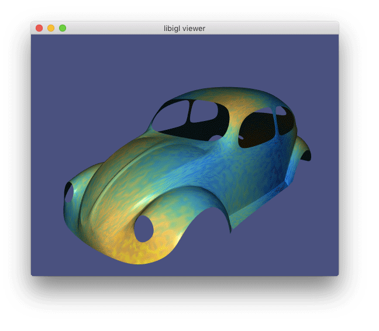
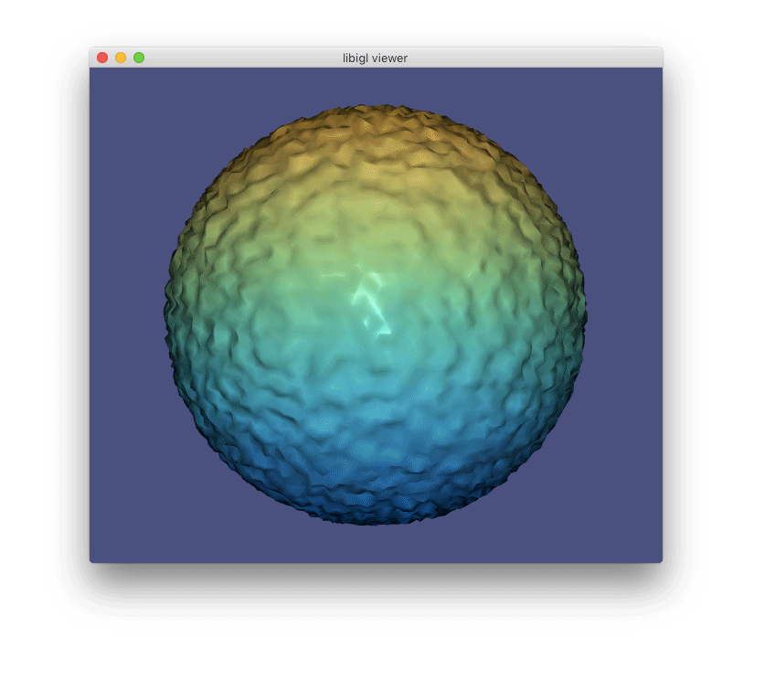

# Geometry Processing Smoothing

> **To get started:** Fork this repository then issue
> 
>     git clone --recursive http://github.com/[username]/geometry-processing-smoothing.git
>

## Installation, Layout, and Compilation

See
[introduction](http://github.com/alecjacobson/geometry-processing-introduction).

## Execution

Once built, you can execute the assignment from inside the `build/` by running
on a given mesh with given scalar field (in
[dmat](http://libigl.github.io/libigl/file-formats/dmat.html) format).

    ./smoothing [path to mesh.obj] [path to data.dmat]

or to load a mesh with phony noisy data use:

    ./smoothing [path to mesh.obj] n

or to load a mesh with smooth z-values as data (for mesh smoothing only):

    ./smoothing [path to mesh.obj]

## Background

In this assignment we will explore how to smooth a data _signal_ defined over a
curved surface. The data _signal_ may be a scalar field defined on a static
surface: for example, noisy temperatures on the surface of an airplane.
Smoothing in this context can be understood as [data
denoising](https://en.wikipedia.org/wiki/Noise_reduction):

The _signal_ could also be the geometric positions of the surface itself. In
this context, smoothing acts also affects the underlying geometry of the
domain. We can understand this operation as [surface
fairing](https://en.wikipedia.org/wiki/Surface_fairng):

### Flow-based formulation

In both cases, the underlying mathematics of both operations will be very
similar. If we think of the signal as undergoing a _flow_ toward a smooth
solution over some phony notion of "time", then the governing partial
differential equation we will start with sets the change in signal value $u$
over time [proportional
to](https://en.wikipedia.org/wiki/Proportionality_(mathematics)) the
[Laplacian](https://en.wikipedia.org/wiki/Laplace_operator) of the signal $\Delta u$
(for now, roughly the second derivative of the signal as we move _on_ the
surface):

$$
\frac{\partial  u}{\partial  t} = {\lambda} \Delta  u,
$$

where the scalar parameter ${\lambda}$ controls the rate of smoothing.

When the signal is the surface geometry, we call this a [geometric
flow](https://en.wikipedia.org/wiki/Geometric_flow).

There are various ways to motivate this choice of flow for
data-/geometry-smoothing. Let us consider one way that will introduce the
Laplacian as a form of local averaging.

Given a noisy signal $f$, intuitively we can _smooth_ $f$ by averaging every
value with its neighbors' values. In continuous math, we might write that the
smoothed value $u(\mathbf{x})$ at any point on our surface $\mathbf{x} \in  \mathbf{S}$ should be equal to
the average value of some small
[ball](https://en.wikipedia.org/wiki/Ball_(mathematics)) of nearby points:

$$
u(\mathbf{x}) = \frac{1}{|B(\mathbf{x}))|} \int _{B(\mathbf{x})} f(\mathbf{z}) \;d\mathbf{z},
$$

If the ball $B(\mathbf{x})$ is small, then we will have to repeat this averaging many
times to see a global smoothing effect. Hence, we can write that the current
value $u^t$ _flows_ toward smooth solution by small steps ${\delta}t$ in time:

$$
u^{t+{\delta}t}(\mathbf{x}) = \frac{1}{|B(\mathbf{x}))|} \int _{B(\mathbf{x})} u^t(\mathbf{z}) \;d\mathbf{z}.
$$

Subtracting the current value $u^t(\mathbf{x})$ from both sides and introducing a
flow-speed parameter ${\lambda}$ we have a flow equation
describing the change in value as an integral of relative values:

$$
\frac{\partial  u}{\partial  t} 
  = {\lambda} \frac{1}{|B(\mathbf{x}))|} \int _{B(\mathbf{x})} (u(\mathbf{z})-u(\mathbf{x})) \;d\mathbf{z}.
$$

For harmonic functions, $\Delta u =0$, this integral becomes zero in the limit as the
radius of the ball shrinks to zero via satisfaction of the
[mean value
theorem](https://en.wikipedia.org/wiki/Harmonic_function#The_mean_value_property).
It follows for a non-harmonic $\Delta u \ne  0$ this integral is equal to the Laplacian
of the $u$, so we have arrived at our flow equation:

$$
\frac{\partial  u}{\partial  t} 
  = \lim_{|B(\mathbf{x})| \Rightarrow  0}  {\lambda} \frac{1}{|B(\mathbf{x}))|} \int _{B(\mathbf{x})} (u(\mathbf{z})-u(\mathbf{x})) \;d\mathbf{z} 
  = {\lambda} \Delta  u.
$$

### Energy-based formulation

Alternatively, we can think of a single smoothing operation as the solution to
an energy minimization problem. If $f$ is our noisy signal over the surface,
then we want to find a signal $u$ such that it simultaneously minimizes its
difference with $f$ and minimizes its variation over the surface:

$$
u^* 
  = \mathop{\text{argmin}}_u E_(u) 
  = 
  \mathop{\text{argmin}}_u \frac12 \int _\mathbf{S} ( \underbrace{(f-u)^{2}}_\text{data} + 
  \underbrace{{\lambda}\| {\nabla}u\| ^{2}}_\text{smoothness} )\;dA,
$$

where again the scalar parameter ${\lambda}$ controls the rate of smoothing. This
energy-based formulation is equivalent to the flow-based formulation.
Minimizing these energies is identical to stepping forward one temporal unit in
the flow.

#### Calculus of variations
In the smooth setting, our energy $E$ is a function that measures scalar value
of a given function _u_, making it a
[functional](https://en.wikipedia.org/wiki/Functional_(mathematics)). To
understand how to _minimize_ a functional with respect to an unknown function,
we will need concepts from the [calculus of
variations](https://en.wikipedia.org/wiki/Calculus_of_variations).

We are used to working with minimizing quadratic _functions_ with respect to a
discrete set of variables, where the minimum is obtained when the gradient of
the energy with respect to the variables is zero.

In our case, the functional $E(u)$ is quadratic in $u$ (recall that the
[gradient operator](https://en.wikipedia.org/wiki/Gradient) ${\nabla}$ is a linear
operator). The function $u$ that minimizes $E(u)$ will be obtained when any
small change or _variation_ in $u$ has no change on the energy values. To
create a small change in a function $u$ we will add another function $v$ times
a infinitesimal scalar ${\epsilon}$. If $E(u)$ is minimized for a function $w$ and we
are given another arbitrary function $v$, then let us define a function new
function 

$$
{\phi}({\epsilon}) = E(w+{\epsilon}v) = \frac12 \int _\mathbf{S} ((f-w+{\epsilon}v)^{2} + {\lambda} \| {\nabla}w + {\epsilon}{\nabla}v\| ^{2})  \;dA,
$$

where we observe that ${\phi}$ is quadratic in ${\epsilon}$.

Since $E(w)$ is minimal then ${\phi}$ is minimized when ${\epsilon}$ is zero, and if ${\phi}$ is
minimal at ${\epsilon}=0$, then the derivative of ${\phi}$ with respect ${\epsilon}$ must be zero:

\begin{align*}
0 & = \left.\frac{\partial {\phi}}{\partial {\epsilon}} \right|_{{\epsilon} = 0},\\
  & = \left.\frac{\partial }{\partial {\epsilon}} \frac12 \int _\mathbf{S} ( (f-w-{\epsilon}v)^{2} + {\lambda} \| {\nabla}w + {\epsilon}{\nabla}v\| ^{2})\;dA, \right|_{{\epsilon} = 0} \\
  & = \left.\frac{\partial }{\partial {\epsilon}} \frac12 \int _\mathbf{S} (
    f^2 - 2wf - 2{\epsilon}fv +w^{2}+2{\epsilon}vw +{\epsilon}^{2}v^{2} + {\lambda} \| {\nabla}w\| ^{2} + {\lambda}2{\epsilon}{\nabla}v\cdot {\nabla}w + {\lambda} {\epsilon}^{2}\| {\nabla}w\| ^{2}) \;dA \right|_{{\epsilon} = 0}\\
  & = \left.\int _\mathbf{S} (-fv + vw +2{\epsilon}vw  + {\lambda}{\nabla}v\cdot {\nabla}w + {\lambda} {\epsilon}\| {\nabla}w\| ^{2}) \;dA \right|_{{\epsilon} = 0}\\
  & = \int _\mathbf{S} (v(w-f)  + {\lambda}{\nabla}v\cdot {\nabla}w )\;dA.
\end{align*}

The choice of "test" function $v$ was arbitrary, so this must hold for any
(reasonable) choice of $v$:

$$
0 = \int _\mathbf{S} (v(w-f)  + {\lambda}{\nabla}v\cdot {\nabla}w) \;dA \quad \forall  v.
$$

It is difficult to claim much about $w$ from this equation directly because
derivatives of $v$ are still involved. We can _move_ a derivative from $v$ to a
$w$ by applying [Green's first
identity](https://en.wikipedia.org/wiki/Green's_identities):

$$
0 = \int _\mathbf{S} (v(w-f)  - {\lambda}v\Delta w )\;dA \quad (+  \text{boundary term} )\quad \forall  v,
$$

where we choose to _ignore_ the boundary terms (for now) or equivalently we
agree to work on _closed_ surfaces $\mathbf{S}$.

Since this equality must hold of _any_ $v$ let us consider functions that are
little ["blips"](https://en.wikipedia.org/wiki/Bump_function) centered at any
arbitrary point $\mathbf{x} \in  \mathbf{S}$. A function $v$ that is one at $\mathbf{x}$ and quickly
decays to zero everywhere else. To satisfy the equation above at $\mathbf{x}$ with this
blip $v$ we must have that:

$$
w(\mathbf{x})-f(\mathbf{x}) = {\lambda}\Delta w(\mathbf{x}).
$$

The choice of $\mathbf{x}$ was arbitrary so this must hold _everywhere_.

Because we invoke _variations_ to arrive at this equation, we call the
_energy-based_ formulation a _variational formulation_.

### Implicit smoothing iteration

Now we understand that the flow-based formulation and the variational
formulation lead to the same system, let us concretely write out the implicit
smoothing step. 

Letting $u^0 = f$ we compute a new smoothed function $u^{t+1}$ given the
current solution $u^t$ by solving the _linear_ system of equations:

$$
u^t(\mathbf{x}) = (\text{id}-{\lambda}\Delta )u^{t+1}(\mathbf{x}), \quad \forall  \mathbf{x} \in  \mathbf{S}
$$

where $\text{id}$ is the [identity
operator](https://en.wikipedia.org/wiki/Identity_function). In the discrete
case, we will need discrete approximations of the $\text{id}$ and $\Delta $
operators.

## Discrete Laplacian

There are many ways to derive a discrete
approximation of the Laplacian $\Delta $ operator on a triangle mesh using:

 - [finite volume method](https://en.wikipedia.org/wiki/Finite_volume_method),
    - "The solution of partial differential equations by means of electrical
      networks"  [MacNeal 1949, pp. 68],
    - "Discrete differential-geometry operators for triangulated
      2-manifolds"  [Meyer et al. 2002],
    - _Polygon mesh processing_ [Botsch et al. 2010],
 - [finite element
   method](https://en.wikipedia.org/wiki/Finite_element_method),
    - "Variational methods for the solution of problems of equilibrium and
      vibrations" [Courant 1943],
    - _Algorithms and Interfaces for Real-Time Deformation of 2D and 3D Shapes_
      [Jacobson 2013, pp. 9]
 - [discrete exterior
   calculus](https://en.wikipedia.org/wiki/Discrete_exterior_calculus)
    - _Discrete Exterior Calculus_ [Hirani 2003, pp. 69]
    - _Discrete Differential Geometry: An Applied Introduction_ [Crane 2013,
      pp. 71]
 - [gradient of surface area \Rightarrow  mean curvature
   flow](https://en.wikipedia.org/wiki/Mean_curvature_flow)
    - "Computing Discrete Minimal Surfaces and Their Conjugates" [Pinkall &
      Polthier 1993]

All of these techniques will produce the _same_ sparse _Laplacian matrix_ $\mathbf{L} \in  \mathbb{R}^{n\times n}$
for a mesh with $n$ vertices. 

### Finite element derivation of the discrete Laplacian

We want to approximate the Laplacian of a function $\Delta u$. Let us consider $u$ to
be [piecewise-linear](https://en.wikipedia.org/wiki/Piecewise_linear_function)
represented by scalar values at each vertex, collected in $\mathbf{u} \in  \mathbb{R}^n$.

Any piecewise-linear function can be expressed as a sum of values at mesh
vertices times corresponding piecewise-linear basis functions  (a.k.a hat
functions, ${\varphi}_i$):

\begin{align*}
u(\mathbf{x}) &= {\sum}_{i=1}^n u_i {\varphi}_i(\mathbf{x}), \\
{\varphi}(\mathbf{x}) &= \begin{cases}
  1 & \text{if $\mathbf{x} = \mathbf{v}_i$}, \\
  \frac{\text{Area($\mathbf{x}$,$\mathbf{v}_j$,$\mathbf{v}_k$)}}{\text{Area($\mathbf{v}_i$,$\mathbf{v}_j$,$\mathbf{v}_k$)}} 
    & \text{if $\mathbf{x} \in  \text{triangle}(i,j,k)$}, \\
  0 & \text{otherwise}.
\end{cases}
\end{align*}

$$
u(\mathbf{x}) = {\sum}_{i=1}^n u_i {\varphi}_i(\mathbf{x}), \\
{\varphi}(\mathbf{x}) = \begin{cases}
  1 & \text{if $\mathbf{x} = \mathbf{v}_i$}, \\
  \frac{\text{Area($\mathbf{x}$,$\mathbf{v}_j$,$\mathbf{v}_k$)}}{\text{Area($\mathbf{v}_i$,$\mathbf{v}_j$,$\mathbf{v}_k$)}} 
    & \text{if $\mathbf{x} \in  \text{triangle}(i,j,k)$}, \\
  0 & \text{otherwise}.
\end{cases}
$$

By plugging this definition into our smoothness energy above, we have discrete
energy that is quadratic in the values at each mesh vertex:

\begin{align*}
\int _\mathbf{S}  \| {\nabla}u(\mathbf{x})\| ^{2} \;dA  
&= \int _\mathbf{S}  \left\|{\nabla}\left({\sum}_{i=1}^n u_i {\varphi}_i(\mathbf{x})\right)\right\|^2 \;dA  \\
&= \int _\mathbf{S}  \left({\sum}_{i=1}^n u_i {\nabla}{\varphi}_i(\mathbf{x})\right)\cdot \left({\sum}_{i=1}^n u_i {\nabla}{\varphi}_i(\mathbf{x})\right)  \;dA  \\
&= \int _\mathbf{S} {\sum}_{i=1}^n {\sum}_{j=1}^n {\nabla}{\varphi}_i\cdot {\nabla}{\varphi}_j u_i u_j \;dA \\
&= \mathbf{u}^{\mathsf T} \mathbf{L} \mathbf{u}, \quad \text{where } L_{ij} =  \int _\mathbf{S}  {\nabla}{\varphi}_i\cdot {\nabla}{\varphi}_j \;dA.
\end{align*}

By defining ${\varphi}_i$ as piecewise-linear hat functions, the values in the system
matrix $L_{ij}$ are uniquely determined by the geometry of the underlying mesh.
These values are famously known as _cotangent weights_. "Cotangent"
because, as we will shortly see, of their trigonometric formulae and "weights"
because as a matrix $\mathbf{L}$ they define a weighted [graph
Laplacian](https://en.wikipedia.org/wiki/Laplacian_matrix) for the given mesh.
Graph Laplacians are employed often in geometry processing, and often in
discrete contexts ostensibly disconnected from FEM. The choice or manipulation
of Laplacian weights and subsequent use as a discrete Laplace operator has been
a point of controversy in geometry processing research (see "Discrete laplace
operators: no free lunch" [Wardetzky et al. 2007]).

We first notice that ${\nabla}{\varphi}_i$ are constant on each triangle, and only nonzero on
triangles incident on node $i$. For such a triangle, $T_{\alpha}$, this ${\nabla}{\varphi}_i$ points
perpendicularly from the opposite edge $e_i$ with inverse magnitude equal to
the height $h$ of the triangle treating that opposite edge as base:

$$
\|{\nabla}{\varphi}_i\| = \frac{1}{h} = \frac{\|\mathbf{e}_i\|}{2A},
$$

where $\mathbf{e}_i$ is the edge $e_i$ as a vector and $A$ is the area of the triangle.

Now, consider two neighboring nodes $i$ and $j$, connected by some edge
$\mathbf{e}_{ij}$. Then ${\nabla}{\varphi}_i$ points toward node $i$ perpendicular to $\mathbf{e}_i$ and
likewise ${\nabla} {\varphi}_j$ points toward node $j$ perpendicular to $\mathbf{e}_j$. Call the angle
formed between these two vectors ${\theta}$. So we may write:

$$
{\nabla} {\varphi}_i \cdot  {\nabla} {\varphi}_j = \|{\nabla} {\varphi}_i\| \|{\nabla} {\varphi}_j\| \cos {\theta} =
\frac{\|\mathbf{e}_j\|}{2A}\frac{\|\mathbf{e}_i\|}{2A} \cos {\theta}. 
$$

Now notice that the angle between $\mathbf{e}_i$ and $\mathbf{e}_j$, call it ${\alpha}_{ij}$,
is ${\pi} - {\theta}$, but more importantly that:
$$
\cos {\theta} = - \cos \left({\pi} - {\theta}\right) = -\cos {\alpha}_{ij}.
$$

So, we can rewrite equation the cosine law equation above into:
$$
-\frac{\|\mathbf{e}_j\|}{2A}\frac{\|\mathbf{e}_i\|}{2A} \cos 
{\alpha}_{ij}.
$$

Now, apply the definition of sine for right triangles:
$$
\sin {\alpha}_{ij} = \frac{h_j}{\|\mathbf{e}_i\|} = \frac{h_i}{\|\mathbf{e}_j\|},
$$

where $h_i$ is the height of the triangle treating $\mathbf{e}_i$ as base, and
likewise for $h_j$. Rewriting the equation above, replacing one of the edge norms,
e.g.\ $\|\mathbf{e}_i\|$:
$$
-\frac{\|\mathbf{e}_j\|}{2A} \frac{\frac{h_j}{\sin{\alpha}_{ij}}}{2A} \cos {\alpha}_{ij}.
$$

Combine the cosine and sine terms:
$$
-\frac{\|\mathbf{e}_j\|}{2A} \frac{h_j}{2A} \cot {\alpha}_{ij}.
$$

Finally, since $\|\mathbf{e}_j\|h_j=2A$, our constant dot product of these
gradients in our triangle is:
$$
{\nabla} {\varphi}_i \cdot  {\nabla} {\varphi}_j = -\frac{\cot {\alpha}_{ij}}{2A}.
$$

Similarly, inside the other triangle $T_{\beta}$ incident
on nodes $i$ and $j$ with angle ${\beta}_{ij}$ we have a constant dot
product:
$$
{\nabla} {\varphi}_i \cdot  {\nabla} {\varphi}_j = -\frac{\cot {\beta}_{ij}}{2B},
$$

where $B$ is the area $T_{\beta}$.

Recall that ${\varphi}_i$ and ${\varphi}_j$ are only both nonzero inside these two
triangles, $T_{\alpha}$ and $T_{\beta}$.  So, since these constants are inside an
integral over area  we may write:
$$
\int\limits_\mathbf{S} {\nabla} {\varphi}_i \cdot  {\nabla} {\varphi}_j \;dA = 
\left.A{\nabla} {\varphi}_i \cdot  {\nabla} {\varphi}_j \right|_{T_{\alpha}} + \left.B{\nabla} {\varphi}_i \cdot  {\nabla} {\varphi}_j \right|_{T_{\beta}}
=
-\frac{1}{2} \left( \cot {\alpha}_{ij} + \cot {\beta}_{ij} \right).
$$

## Mass matrix

Treated as an _operator_ (i.e., when used multiplied against a vector $\mathbf{L}\mathbf{u}$),
the Laplacian matrix $\mathbf{L}$ computes the local integral of the Laplacian of a
function $u$. In the energy-based formulation of the smoothing problem this is
not an issue. If we used a similar FEM derivation for the _data term_ we would
get another sparse matrix $\mathbf{M} \in  \mathbb{R}^{n \times  n}$:

$$
\int _\mathbf{S} (u-f)^{2} \;dA 
  = \int _\mathbf{S} {\sum}_{i=1}^n {\sum}_{j=1}^n {\varphi}_i\cdot {\varphi}_j (u_i-f_i) (u_j-f_j) \;dA =
  (\mathbf{u}-\mathbf{f})^{\mathsf T} \mathbf{M} (\mathbf{u}-\mathbf{f}),
$$

where $\mathbf{M}$ as an operator computes the local integral of a function's value
(i.e., $\mathbf{M}\mathbf{u}$).

This matrix $\mathbf{M}$ is often _diagonalized_ or _lumped_ into a diagonal matrix,
even in the context of FEM. So often we will simply set:

$$
M_{ij} = 
\begin{cases}
  \frac13  {\sum}_{t=1}^m \begin{cases}
  \text{Area}(t) & \text{if triangle $t$ contains vertex $i$} \\
  0 & \text{otherwise}
  \end{cases}
  & \text{if $i=j$}\\
  0 & \text{otherwise},
\end{cases}
$$

for a mesh with $m$ triangles.

If we start directly with the continuous smoothing iteration equation, then we
have a point-wise equality. To fit in our integrated Laplacian $\mathbf{L}$ we should
convert it to a point-wise quantity. From a units perspective, we need to
divide by the local area. This would result in a discrete smoothing iteration
equation:

$$
\mathbf{u}^t = (\mathbf{I} - {\lambda}\mathbf{M}^{-1} \mathbf{L})\mathbf{u}^{t+1},
$$

where $\mathbf{I} \in  \mathbb{R}^{n\times n}$ is the identity matrix. This equation is _correct_ but
the resulting matrix $\mathbf{A} := \mathbf{I} - {\lambda}\mathbf{M}^{-1} \mathbf{L}$ is not symmetric and thus slower
to solve against.

Instead, we could take the healthier view of requiring our smoothing iteration
equation to hold in a locally integrated sense. In this case, we replace mass
matrices on either side:

$$
\mathbf{M} \mathbf{u}^t = (\mathbf{M} - {\lambda}\mathbf{L})\mathbf{u}^{t+1}.
$$

Now the system matrix $\mathbf{A} := \mathbf{M} + {\lambda}\mathbf{L}$ will be symmetric and we can use
[Cholesky factorization](https://en.wikipedia.org/wiki/Cholesky_decomposition)
to solve with it.

### Laplace Operator is Intrinsic

The discrete Laplacian operator and its accompanying mass matrix are
_intrinsic_ operators in the sense that they _only_ depend on lengths. In
practical terms, this means we do not need to know _where_ vertices are
actually positioned in space (i.e., $\mathbf{V}$). Rather we only need to know the
relative distances between neighboring vertices (i.e., edge lengths). We do not
even need to know which dimension this mesh is [living
in](https://en.wikipedia.org/wiki/Embedding).

This also means that applying a transformation to a shape that does not change
any lengths on the surface (e.g., bending a sheet of paper) will have no affect
on the Laplacian.

### Data denoising

For the data denoising application, our geometry of the domain is not changing
only the scalar function living upon it. We can build our discrete Laplacian
$\mathbf{L}$ and mass matrix $\mathbf{M}$ and apply the above formula with a chosen ${\lambda}$
parameter.

### Geometric smoothing

For geometric smoothing, the Laplacian operator (both $\Delta $ in the continuous
setting and $\mathbf{L},\mathbf{M}$ in the discrete setting) depend on the geometry of the
surface $\mathbf{S}$. So if the signal $u$ is replaced with the positions of points on
the surface (say, $\mathbf{V} \in  \mathbb{R}^{n\times 3}$ in the discrete case), then the smoothing
iteration update rule is a _non-linear_ function if we write it as:

$$
\mathbf{M}^{t+1} \mathbf{V}^t = (\mathbf{M}^{t+1} - {\lambda}\mathbf{L}^{t+1})\mathbf{V}^{t+1}.
$$

However, if we assume that small changes in $\mathbf{V}$ have a negligible effect on
$\mathbf{L}$ and $\mathbf{M}$ then we can discretize _explicitly_ by computing $\mathbf{L}$ and $\mathbf{M}$
_before_ performing the update:

$$
\mathbf{M}^{t} \mathbf{V}^t = (\mathbf{M}^{t} - {\lambda}\mathbf{L}^{t}) \mathbf{V}^{t+1}.
$$

### Why did my mesh disappear?

Repeated application of geometric smoothing may cause the mesh to "disappear".
Actually the updated vertex values are being set to
[NaNs](https://en.wikipedia.org/wiki/NaN) due to degenerate numerics. We are
rebuilding the discrete Laplacian at every new iteration, regardless of the
"quality" of the mesh's triangles. In particular, if a triangle tends to become
skinnier and skinnier during smoothing, what will happen to the cotangents of
its angles?

In "Can Mean-Curvature Flow Be Made Non-Singular?", Kazhdan et al. derive a new
type of geometric flow that is stable (so long as the mesh at time $t=0$ is
reasonable). Their change is remarkably simple: do not update $\mathbf{L}$, only update
$\mathbf{M}$.

## Tasks

### Learn an alternative derivation of cotangent Laplacian

The "cotangent Laplacian" by far the most important tool in geometry
processing. It comes up everywhere. It is important to understand where it
comes from and be able to derive it (in one way or another).

The background section above contains a FEM derivation of the discrete
"cotangnet Laplacian". For this (unmarked) task, read and understand one of the
_other_ derivations listed above.

> **Hint:** The finite-volume method used in [Botsch et al. 2010] is perhaps
> the most accessible alternative.

### White list

  - `igl::doublearea`
  - `igl::edge_lengths`

### Black list

  - `igl::cotmatrix_entries`
  - `igl::cotmatrix`
  - `igl::massmatrix`
  - Trig functions `sin`, `cos`, `tan` etc. (e.g., from `#include <cmath>`)
    _See background notes about "intrinisic"-ness_

### `src/cotmatrix.cpp`

Construct the "cotangent Laplacian" for a mesh with edge lengths `l`. Each
entry in the output sparse, symmetric matrix `L` is given by:

$$
L_{ij} = \begin{cases}
         \frac12  \cot{{\alpha}_{ij}} + \frac12  \cot{{\beta}_{ij}}  & \text{if edge $ij$ exists} \\
         - {\sum}_{j\ne i} L_{ij}                   & \text{if $i = j$} \\
         0                                & \text{otherwise}
         \end{cases}
$$

> Hint: Review the [law of sines](https://en.wikipedia.org/wiki/Law_of_sines)
> and [law of cosines](https://en.wikipedia.org/wiki/Law_of_cosines) and
> [Heron's ancient formula](https://en.wikipedia.org/wiki/Heron's_formula) to
> derive a formula for the cotangent of each triangle angle that _only_ uses
> edge lengths.

### `src/massmatrix.cpp`

Construct the diagonal(ized) mass matrix `M` for a mesh with given face indices
in `F` and edge lengths `l`.

### `src/smooth.cpp`

Given a mesh (`V`,`F`) and data specified per-vertex (`G`), smooth this data
using a single implicit Laplacian smoothing step.

This data could be a scalar field on the surface and smoothing corresponds to
data denoising.

Or the data could be the vector field of the surface's own geometry. This
corresponds to geometric smoothing.

